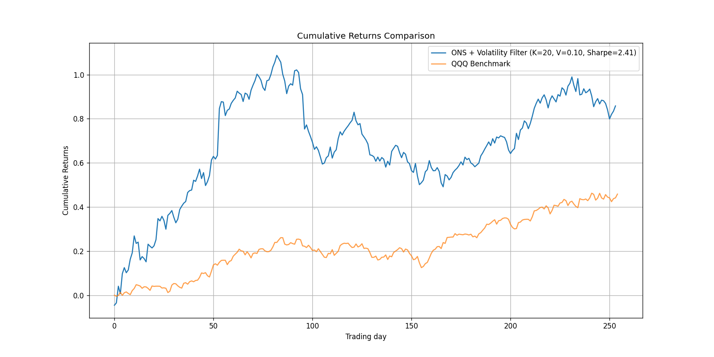

# Online Newton Step Portfolio Optimization

Implementation of the Online Newton Step (ONS) algorithm for sequential portfolio
selection (Agarwal, Hazan, Kale & Schapire, 2006), with two extensions: a per-stock
volatility filter and a correlation-distance diversification constraint.

*Convex optimization (QP) · online/sequential learning · risk-constrained portfolio
construction · numerical linear algebra.*

Columbia University research project, Spring 2024, advised by Prof. Eric Balkanski.
Presented at the [Columbia Data Science Undergraduate Research Fair 2024](https://datascience.columbia.edu/events/undergraduate-research-fair-2024/) (P14).
Poster: [`poster.pdf`](poster.pdf).

**Contributors:** Minhao Pang, Zhengtao Su.

## Method

ONS treats sequential portfolio selection as online convex optimization over the
simplex. At each step $t$, given relative price relatives $r_t \in \mathbb{R}^n$
($r_{t,i} = S_{t,i}/S_{t-1,i} - 1$), the portfolio $p_t$ realizes log-wealth growth
$f_t(p_t) = -\log(p_t \cdot r_t)$. ONS takes a regularized Newton step on the
cumulative loss, using the outer-product matrix $A_t = \sum_{\tau \le t} \nabla
f_\tau \nabla f_\tau^\top$ in place of the true (unavailable) Hessian, then projects
back onto the simplex in the $A_t$-induced norm — a QP solved with `cvxopt`.

Two extensions in this repo, applied after the Newton step's projected weight $y_t$
is computed:

- **Volatility filter** (`ons_volatility_filter.py`): zero the weight of any asset
  whose realized return std over the trailing $K$ days exceeds a threshold $V$, then
  renormalize the remaining weights.
- **Distance-threshold constraint** (`ons_distance_threshold.py`): re-solve the
  projection with an added linear constraint capping the portfolio's average
  pairwise correlation-distance ($\sqrt{2(1-\rho_{ij})}$), estimated from a trailing
  correlation matrix, discouraging concentration in highly-correlated names.

## Contents

```
ons.py                       base ONS vs. an equal-weighted benchmark
ons_volatility_filter.py     ONS + trailing-volatility filter
ons_distance_threshold.py    ONS + correlation-distance diversification constraint
data/                        daily returns, ~100 QQQ-index constituents (2022-2024)
results/                     output figures
poster.pdf                   research fair poster
```

## Setup

```bash
pip install -r requirements.txt
python ons.py
python ons_volatility_filter.py
python ons_distance_threshold.py
```

Each script is self-contained and runs from the repo root.



*ONS + volatility filter (K=20, V=0.10), Sharpe 2.41, vs. QQQ over the same window.*

## Implementation notes

`ons_volatility_filter.py` implements Algorithm 2 directly from the poster's
pseudocode. Results are sensitive to β, K, and V; the setting used above (K=20,
V=0.10) reproduces the poster's qualitative finding — the volatility filter raises
Sharpe substantially over plain ONS — and approximates its return magnitude (0.86 vs.
the poster's 0.88 at the same K/V). Exact figures depend on preprocessing/solver
details not fully specified in the pseudocode; tighter filter settings (K=3–5) are
numerically unstable under a literal reading of the projection step.

## References

- Agarwal, A., Hazan, E., Kale, S., & Schapire, R. E. (2006). Algorithms for portfolio
  management based on the Newton Method. *ICML '06*.
- Markowitz, H. (1952). Portfolio Selection. *The Journal of Finance*, 7(1), 77–91.

## License

MIT — see [LICENSE](LICENSE).
